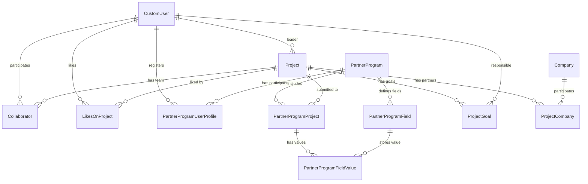

# Разделы ВКР по серверной части ProCollab

## Описание архитектуры серверной части

Серверная часть системы ProCollab реализована как модульное веб-приложение на базе фреймворка Django и библиотеки Django REST Framework. Backend выполняет роль центрального слоя бизнес-логики: принимает HTTP-запросы от клиентского приложения, проверяет права доступа, валидирует входные данные, выполняет операции с базой данных и возвращает ответы в формате JSON. Для административного управления используется встроенная административная панель Django.

Архитектура серверной части построена по принципу разделения предметных областей на независимые приложения Django. В проекте выделены модули `users`, `projects`, `partner_programs`, `chats`, `news`, `vacancy`, `courses`, `files`, `events`, `feed`, `metrics`, `mailing`, `project_rates` и ряд вспомогательных модулей. Такой подход упрощает сопровождение системы: логика пользователей, проектов, программ, файлов, новостей и коммуникаций расположена в отдельных пакетах, но объединяется общими настройками, маршрутизацией и механизмами аутентификации.

Основной точкой конфигурации является пакет `procollab`. В файле `settings.py` задаются подключенные приложения, middleware, настройки REST API, база данных, кэширование, CORS, JWT-аутентификация и параметры работы в режиме разработки или эксплуатации. В режиме разработки используется SQLite и файловый/локальный кэш, а в производственной конфигурации предусмотрены PostgreSQL и Redis. Файл `urls.py` содержит верхнеуровневую маршрутизацию и подключает URL-модули предметных приложений: `/auth/` для пользователей, `/projects/` для проектов, `/programs/` для партнерских программ и другие API-разделы.

Обработка HTTP-запросов строится вокруг стандартной для Django REST Framework связки: модели описывают структуру данных и связи между сущностями; сериализаторы преобразуют модели в JSON и валидируют входные данные; представления реализуют сценарии чтения и изменения данных; permissions ограничивают доступ к действиям в зависимости от пользователя и роли; URL-маршруты связывают публичные API-адреса с представлениями.

Для аутентификации используется пользовательская модель `CustomUser`, указанная как `AUTH_USER_MODEL`. В REST API применяются JWT-токены через `djangorestframework-simplejwt`; дополнительно реализован собственный класс `ActivityTrackingJWTAuthentication`, который позволяет фиксировать активность пользователя при обращении к API. По умолчанию для REST-запросов используется пользовательский permission-класс `CustomIsAuthenticated`, поэтому доступ к защищенным ресурсам контролируется централизованно.

Сервер поддерживает не только синхронные HTTP-запросы, но и асинхронные сценарии. Для WebSocket-коммуникаций используется Django Channels: в `asgi.py` HTTP-трафик направляется в стандартное ASGI-приложение Django, а WebSocket-соединения проходят через `TokenAuthMiddleware` и маршрутизируются в модуль чатов. Это позволяет использовать единый backend как для REST API, так и для событийного обмена в реальном времени.

Фоновые задачи вынесены в Celery. Конфигурация Celery размещена в `procollab/celery.py`, где подключается автопоиск задач по приложениям и задается расписание периодических процессов. В расписании присутствуют, например, задачи уведомлений по вакансиям, запуск сценариев рассылок по программам и публикация проектов завершенных программ. Для кэширования и канального слоя в эксплуатационной среде используется Redis.

Таким образом, серверная часть имеет слоистую и модульную архитектуру: внешний слой представлен REST API и WebSocket-маршрутами, прикладной слой расположен в представлениях, сервисах и задачах, доменный слой описан моделями Django, а инфраструктурный слой включает PostgreSQL/SQLite, Redis, Celery, файловое хранилище и систему email-рассылок.

## Выбранный фреймворк

В качестве основного backend-фреймворка выбран Django. Выбор Django обусловлен тем, что он предоставляет готовую инфраструктуру для разработки серверных веб-приложений: ORM для работы с базой данных, систему миграций, административную панель, middleware, маршрутизацию, шаблоны, механизмы безопасности и расширяемую модель пользователей.

Для реализации API используется Django REST Framework. Он расширяет Django средствами построения REST-интерфейсов: сериализаторами, классами представлений, наборами прав доступа, пагинацией, фильтрацией и рендерингом ответов. Благодаря этому серверная часть может отдавать данные клиентскому приложению в формате JSON и принимать структурированные запросы на создание или изменение сущностей.

В проекте применяются и дополнительные компоненты экосистемы Django: `djangorestframework-simplejwt` для JWT-аутентификации, `django-filter` для фильтрации списковых API, `drf-yasg` для Swagger и ReDoc-документации, `django-cors-headers` для настройки доступа клиентского приложения к API, `channels` и `channels-redis` для WebSocket-соединений, `celery` и `django-celery-beat` для фоновых и периодических задач, `django-cleanup` для управления файлами и `django-anymail` для email-интеграций.

Django подходит для данной системы, потому что ProCollab содержит много связанных сущностей: пользователей, роли, проекты, программы, новости, файлы, курсы, вакансии и оценки. ORM Django позволяет выразить эти связи на уровне моделей, а миграции фиксируют изменение структуры базы данных. Административная панель полезна для управления справочниками, программами, пользователями и контентом без разработки отдельного внутреннего интерфейса.

## Проектирование и описание структуры базы данных

База данных проектируется как реляционная модель. В разработке приложение может использовать SQLite, а для производственной эксплуатации предусмотрена PostgreSQL. Структура таблиц формируется моделями Django и миграциями. Ниже описана часть текущей базы данных, относящаяся к пользователям, программам и проектам.

### Пользователи

Центральная сущность пользовательского блока - модель `CustomUser`. Она расширяет стандартную модель Django `AbstractUser`, но вместо имени пользователя использует email как уникальный идентификатор входа. В таблице пользователя хранятся основные учетные и профильные данные: email, имя, фамилия, отчество, пароль, тип пользователя, аватар, дата рождения, описание, статус, регион, город, телефон, специальность, стадия онбординга, дата верификации, дата последней активности, признаки студента Московского Политеха и учебная группа.

Поле `user_type` определяет основную роль пользователя в системе. Для детализации ролей используются отдельные связанные таблицы: `Member` хранит данные участника, `Mentor` хранит данные ментора, `Expert` хранит данные эксперта и может быть связан с программами, `Investor` хранит данные инвестора. Каждая из этих моделей связана с `CustomUser` отношением один-к-одному.

Дополнительные профильные данные вынесены в отдельные таблицы. `UserEducation` описывает образование пользователя, `UserWorkExperience` - опыт работы, `UserLanguages` - языки и уровни владения, `UserAchievement` - достижения пользователя. Для файлов достижений используется промежуточная таблица `UserAchievementFile`, связывающая достижение с пользовательским файлом и проверяющая принадлежность файла тому же пользователю.

Связь пользователей с проектами выражена несколькими способами. Пользователь может быть лидером проекта через поле `Project.leader`, участником проекта через таблицу `Collaborator`, подписчиком проекта через many-to-many поле `Project.subscribers`, ответственным за цель проекта через `ProjectGoal.responsible`, а также автором лайка через `LikesOnProject`. Для пользовательских ссылок используется таблица `UserLink`, где пара пользователь-ссылка уникальна.

### Проекты

Основная сущность проектного блока - модель `Project`. Она хранит название, описание, регион, внутренний рейтинг сортировки, актуальность, целевую аудиторию, уровень технологической готовности TRL, срок реализации, проблему, отрасль, ссылки на презентацию и изображения, признак черновика, признак компании, публичность, дату создания и дату изменения.

Ключевая связь проекта с пользователем задается через поле `leader`: один пользователь может быть лидером многих проектов, но у каждого проекта есть один лидер. Команда проекта описывается моделью `Collaborator`, которая связывает пользователя и проект, хранит роль участника и его специализацию. Для пары проект-пользователь задано ограничение уникальности, поэтому один пользователь не может быть добавлен в один и тот же проект как коллаборатор несколько раз.

Для проектного блока также используются вспомогательные таблицы: `ProjectLink` хранит внешние ссылки проекта, `Achievement` хранит достижения проекта, `ProjectNews` хранит новости проекта, `ProjectGoal` хранит цели проекта, `Company` хранит компании-партнеры с уникальным ИНН, `ProjectCompany` связывает проект с компанией, а `Resource` описывает требуемые или предоставляемые ресурсы проекта.

Отдельная бизнес-проверка реализована в модели `Collaborator`: если проект привязан к партнерской программе, добавить участника в команду можно только при условии, что этот пользователь зарегистрирован в соответствующей программе. Это ограничение поддерживает согласованность между блоком проектов и блоком программ.

### Программы

Программы представлены моделью `PartnerProgram`. Она хранит название, тег, описание, город, изображения, ссылку на презентацию, ссылку регистрации, признаки конкурсности и распределенного оценивания, максимальное число оценок проекта, схему данных в формате JSON, настройки доступности проектов, даты регистрации, подачи проектов, оценки, начала и завершения программы, а также даты создания и изменения.

Связь программы с пользователями реализована через таблицу `PartnerProgramUserProfile`. Это промежуточная модель между `PartnerProgram` и `CustomUser`, которая хранит не только факт участия пользователя, но и дополнительные регистрационные данные в поле `partner_program_data`. Для пары пользователь-программа установлено ограничение уникальности. В этой же модели может быть указана связь с проектом пользователя в рамках программы.

У программ также есть менеджеры - пользователи, имеющие право управлять программой и ее контентом. Эта связь реализована many-to-many полем `PartnerProgram.managers`. Эксперты могут быть связаны с программами через поле `Expert.programs`, что позволяет ограничивать или настраивать экспертную работу по конкретным программам.

Связь программ и проектов вынесена в модель `PartnerProgramProject`. Она соединяет `PartnerProgram` и `Project`, хранит признак сдачи проекта, дату сдачи и ограничивает дублирование пары программа-проект. Метод `can_edit` определяет, может ли пользователь редактировать проект в рамках программы: администратор и staff-пользователь имеют доступ всегда, лидер проекта может редактировать проект до момента сдачи.

Для динамических форм программ используются модели `PartnerProgramField` и `PartnerProgramFieldValue`. `PartnerProgramField` описывает дополнительное поле программы: служебное имя, отображаемое название, тип поля, обязательность, подсказку, признак отображения в фильтрах и список опций. `PartnerProgramFieldValue` хранит значение поля для конкретного проекта, участвующего в программе. Для пары проект-в-программе и поле задано ограничение уникальности, что исключает несколько значений одного поля для одного проектного участия.

Материалы программ описываются моделью `PartnerProgramMaterial`. Материал может быть задан ссылкой или файлом; при наличии файла ссылка берется из связанного файлового объекта. Валидация запрещает сохранять материал без источника и предотвращает противоречивое заполнение файла и внешней ссылки.

### Основные связи предметной области

Упрощенно связи между рассматриваемыми сущностями можно представить следующим образом:

Такая структура позволяет хранить общие данные пользователей отдельно от их ролей, описывать проекты как самостоятельные сущности, связывать проекты с командами и компаниями, а программы использовать как надстройку над проектами и пользователями. За счет промежуточных таблиц система может хранить дополнительные атрибуты связей: роль участника в проекте, данные регистрации в программе, состояние сдачи проекта, значения динамических полей и вклад партнерской компании.
