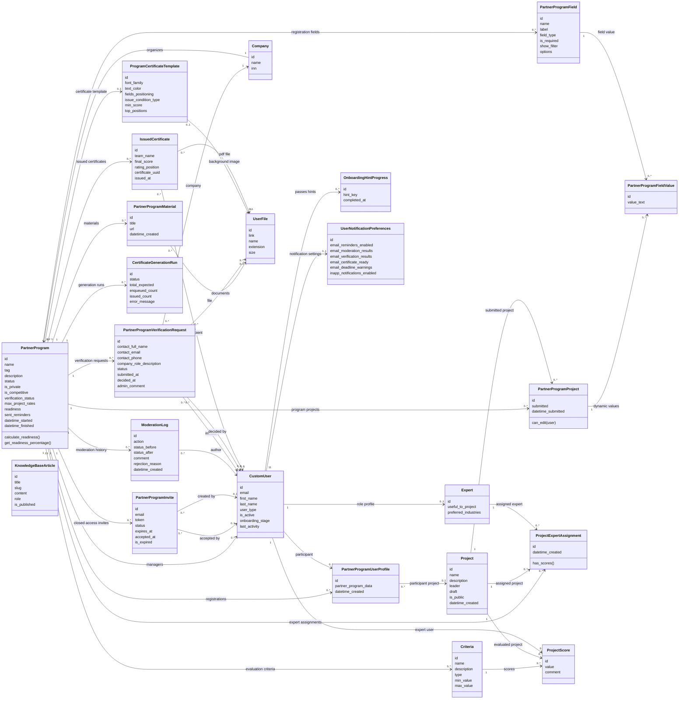

# Диаграмма классов модуля автономного проведения кейс-чемпионатов

## Что необходимо отрисовать на диаграмме

На диаграмме классов необходимо показать структуру модуля автономного проведения кейс-чемпионатов и его связь с уже существующими сущностями платформы PROCOLLAB. Центральной сущностью диаграммы является `PartnerProgram`, так как в рамках проектируемого модуля партнерская программа интерпретируется как кейс-чемпионат.

Вокруг `PartnerProgram` следует отрисовать несколько смысловых групп классов:

1. Базовые сущности платформы, которые переиспользуются без изменения общей архитектуры: `CustomUser`, `Expert`, `Project`, `Company`, `UserFile`.
2. Сущности настройки чемпионата: `PartnerProgramField`, `PartnerProgramFieldValue`, `PartnerProgramMaterial`, `ProgramCertificateTemplate`.
3. Сущности участия: `PartnerProgramUserProfile`, `PartnerProgramProject`, `PartnerProgramInvite`.
4. Сущности экспертной оценки: `Criteria`, `ProjectScore`, `ProjectExpertAssignment`.
5. Сущности контроля и доверия: `ModerationLog`, `PartnerProgramVerificationRequest`.
6. Сущности выдачи результата: `CertificateGenerationRun`, `IssuedCertificate`.
7. Сущности поддержки автономного сценария: `KnowledgeBaseArticle`, `OnboardingHintProgress`, `UserNotificationPreferences`.

Главная идея диаграммы состоит в том, чтобы показать, что новый модуль не заменяет существующую модель платформы, а расширяет ее. Пользователи, проекты, эксперты, файлы и компании остаются общими сущностями системы. Новые классы добавляются только для тех сценариев, которых раньше не хватало: самостоятельная настройка чемпионата организатором, модерация, закрытые приглашения, верификация компании, шаблоны сертификатов, выдача сертификатов, база знаний, подсказки и настройки уведомлений.

При отрисовке диаграммы важно не перегружать ее методами. Для ВКР достаточно показать основные атрибуты классов и связи между ними. Методы можно указывать только для ключевых бизнес-правил, например `can_edit()` у `PartnerProgramProject`, `calculate_readiness()` у `PartnerProgram` и `has_scores()` у `ProjectExpertAssignment`.

Права доступа не следует подробно включать в диаграмму классов. Ролевое и объектное разграничение лучше описать текстом и вынести в отдельную матрицу прав. На диаграмме достаточно показать, что пользователь может быть менеджером чемпионата, экспертом, участником, автором записи модерации, инициатором верификации или получателем сертификата.

## Описание диаграммы на примере

Центральной сущностью модели является `PartnerProgram`, отражающая кейс-чемпионат. С ней связаны сущности, отвечающие за регистрационную форму, материалы, участников, проекты, критерии оценки, назначения экспертов, модерацию, приглашения, верификацию компании, шаблон сертификата и выданные сертификаты.

При проектировании сохранены существующие сущности платформы: пользователь, эксперт, проект, пользовательский файл и компания. Это снижает объем доработок и позволяет встроить новый модуль в текущую архитектуру PROCOLLAB. Новые сущности добавляются только там, где существующей модели недостаточно: для журнала модерации, приглашений в закрытый чемпионат, заявки на верификацию, шаблона сертификата, выданного сертификата, статей базы знаний, прохождения подсказок при первом использовании и пользовательских настроек уведомлений.

Модель `PartnerProgram` расширяется за счет атрибутов, необходимых для управляемого жизненного цикла чемпионата. Вместо простого признака черновика используется статус, отражающий этап работы с чемпионатом: черновик, на модерации, опубликован, отклонен, завершен, заморожен или архивирован. Также добавляются признаки закрытого чемпионата, связи с компанией-организатором, параметры верификации, шаблон сертификата, чек-лист готовности и журнал отправленных напоминаний.

Регистрационная форма чемпионата описывается классом `PartnerProgramField`. Он хранит служебное имя поля, отображаемое название, тип, обязательность и возможные варианты ответа. Значения дополнительных полей для проекта фиксируются в `PartnerProgramFieldValue`, что позволяет каждому чемпионату иметь собственную структуру регистрационных данных без изменения общей таблицы проектов.

Участие пользователя в чемпионате описывает `PartnerProgramUserProfile`. Эта сущность связывает пользователя, чемпионат и при необходимости проект, а также хранит дополнительные данные регистрации в формате JSON. Проект, участвующий в чемпионате, фиксируется через `PartnerProgramProject`. Эта связь хранит состояние сдачи проекта и дату сдачи, а также ограничивает редактирование после отправки на проверку.

Сущности, связанные с экспертной оценкой, позволяют организатору задавать критерии, подключать экспертов и распределять проекты между ними. Класс `Criteria` описывает критерий оценки и допустимый диапазон значения. Класс `ProjectExpertAssignment` связывает чемпионат, проект и эксперта, фиксируя назначение эксперта на конкретный проект. Класс `ProjectScore` хранит оценку проекта по критерию от конкретного пользователя-эксперта. При необходимости оценка может быть расширена текстовым комментарием эксперта, что требуется для более содержательной обратной связи участнику.

Сущности модерации и верификации обеспечивают контролируемую автономность. `ModerationLog` хранит журнал решений администратора или автоматических действий: отправка на модерацию, одобрение, отклонение, заморозка, восстановление, архивация и завершение. `PartnerProgramVerificationRequest` хранит сведения о компании, контактном лице, приложенных документах, статусе рассмотрения и решении администратора. Это позволяет организатору самостоятельно создавать чемпионат, но оставляет платформе контроль качества и доверия.

Закрытые чемпионаты поддерживаются через `PartnerProgramInvite`. Приглашение связывается с чемпионатом, хранит email приглашенного пользователя, уникальный токен, срок действия и статус использования. Это позволяет ограничивать регистрацию только заранее приглашенными участниками.

Сертификаты описываются двумя основными сущностями. `ProgramCertificateTemplate` задает оформление документа, фон, шрифт, цвета, расположение полей и условия выдачи. `IssuedCertificate` связывает участника, чемпионат, итоговые данные и файл сертификата. Дополнительно `CertificateGenerationRun` фиксирует запуск массовой генерации сертификатов, количество ожидаемых и выданных документов, статус выполнения и ошибку при неуспешной генерации.

Сущности поддержки пользователя отвечают за базу знаний, подсказки при первом использовании и настройки уведомлений. `KnowledgeBaseArticle` содержит справочные материалы для организаторов и участников, `OnboardingHintProgress` фиксирует прохождение подсказок, а `UserNotificationPreferences` хранит настройки email- и внутренних уведомлений. Эти классы нужны для снижения сложности нового сценария создания чемпионата, поскольку организатор получает больше самостоятельных действий, чем в текущей централизованной модели.

Разграничение прав доступа реализуется на двух уровнях: ролевом и объектном. Ролевой доступ определяет, какие действия в принципе доступны участнику, организатору, эксперту и администратору. Объектный доступ уточняет права в отношении конкретного чемпионата, проекта или оценки. Организатор может создавать и редактировать только те чемпионаты, где он указан менеджером. Администратор имеет доступ ко всем чемпионатам и выполняет функции модерации, восстановления, архивации и контроля спорных случаев. Эксперт работает только с назначенными ему проектами, а участник взаимодействует только со своими регистрациями, командами, проектами и сертификатами.

Такое разграничение прав поддерживает модель контролируемой автономности. Организатор получает самостоятельность при работе со своими чемпионатами, но публикация и спорные действия остаются под контролем администратора. Это снижает нагрузку на внутреннюю команду, не снимая с платформы ответственность за качество публичного контента.

## Код диаграммы классов

## Примечание к диаграмме

Классы `PartnerProgram`, `PartnerProgramUserProfile`, `PartnerProgramProject`, `PartnerProgramField`, `PartnerProgramFieldValue`, `PartnerProgramMaterial`, `Criteria`, `ProjectScore`, `ProjectExpertAssignment`, `ModerationLog`, `PartnerProgramVerificationRequest`, `PartnerProgramInvite`, `ProgramCertificateTemplate`, `CertificateGenerationRun`, `IssuedCertificate` и `UserNotificationPreferences` соответствуют текущей или расширенной структуре backend-приложения. Классы `KnowledgeBaseArticle` и `OnboardingHintProgress` показаны как проектируемые сущности поддержки автономного пользовательского сценария.
