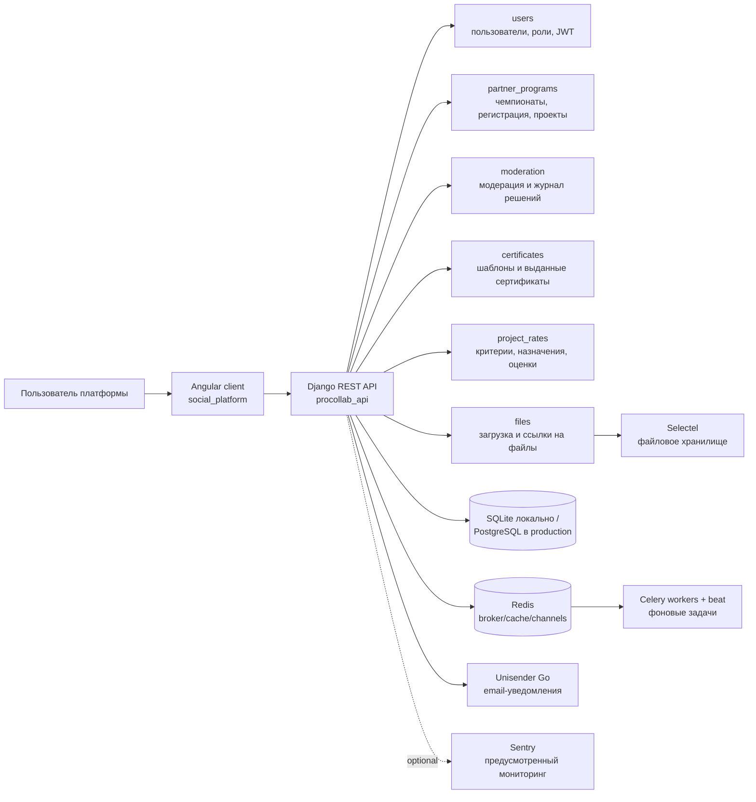

# Пакет фактов для разделов 3.1, 3.2 и 3.3

Документ фиксирует только то, что было подтверждено по текущему локальному состоянию проекта.

## 1. Артефакты для раздела 3.1

### Скриншоты Swagger/ReDoc

Скриншоты сохранены в каталоге `Z:\VKR\artifacts\vkr_screenshots`:

| Файл | Что показывает |
|---|---|
| `01_swagger_programs.png` | Swagger UI, список API, включая `/programs/`, `/api/admin/moderation/...`, certificate endpoints. |
| `02_redoc_api.png` | ReDoc со списком групп API: `programs`, `api`, `auth`, `projects` и др. |

Swagger/ReDoc закрыты правами администратора. Для проверки был создан локальный временный суперпользователь `vkr_admin@example.test`; запрос к `/swagger/` с Basic Auth вернул HTTP 200.

### Подтвержденные API-запросы

Проверено на локальном backend `http://127.0.0.1:8000`:

| Запрос | Результат |
|---|---|
| `GET /programs/?offset=0&limit=20` | HTTP 200 |
| `GET /programs/2/` | HTTP 200 |
| `GET /programs/2/projects/?offset=0&limit=21` | HTTP 200 |
| `GET /auth/users/current/` | HTTP 200 |

Нюанс: API-адрес списка проектов должен использовать завершающий слэш: `/programs/<id>/projects/`. При обращении без слэша возможна потеря авторизационного заголовка на редиректе.

### Интеграции

Фактически в коде настроены:

| Интеграция | Статус в тексте ВКР |
|---|---|
| SQLite локально / PostgreSQL через env в production-настройках | Можно писать как используемую БД: локально SQLite, в инфраструктурной конфигурации PostgreSQL. |
| Redis | Настроен для Celery, cache/channel layers вне DEBUG. Для полного локального прогона фоновых задач Redis должен быть поднят отдельно. |
| Celery + django-celery-beat | Настроены задачи публикации проектов, напоминаний, заморозки чемпионатов, генерации сертификатов, рассылок. |
| Selectel Swift/S3-compatible storage | Реализована конфигурация и сервисная работа с файлами. |
| Unisender Go | Подключен через `django-anymail` как email backend. |
| Telegram Bot API | Переменные предусмотрены для автопостинга. |
| Sentry | Корректная формулировка: "предусмотрена возможность подключения мониторинга ошибок через Sentry". Явной инициализации `sentry_sdk.init(...)` в backend не обнаружено. |

### C4-компонентная схема



## 2. Артефакты для раздела 3.2

Скриншоты frontend сохранены в `Z:\VKR\artifacts\vkr_screenshots`:

| Рисунок | Файл | Что показывать в ВКР |
|---|---|---|
| Рисунок 9 | `09_wizard_basic.png` | Мастер создания чемпионата, шаг "Основное". |
| Рисунок 10 | `10_registration_edit.png` | Настройка регистрации в интерфейсе редактирования чемпионата. |
| Рисунок 11 | `11_program_showcase.png` | Витрина чемпионатов. |
| Рисунок 12 | `12_program_page.png` | Страница опубликованного чемпионата. |
| Рисунок 13 | `13_program_projects.png` | Раздел проектов-участников чемпионата. |

Подтвержденные Angular-маршруты:

| Маршрут | Статус |
|---|---|
| `/office/program/new/basic-info` | Открывается, показывает шаг "Основное". |
| `/office/program/2/edit/registration` | Открывается, показывает настройки регистрационной формы. |
| `/office/program/all` | Открывается, показывает витрину. |
| `/office/program/2` | Открывается, показывает страницу чемпионата. |
| `/office/program/2/projects` | Открывается, показывает проекты-участники. |

В тексте 3.2 важно написать аккуратно: вкладки `verification` и `certificate` во frontend заведены как маршруты и места интеграции, но полноценный пользовательский интерфейс этих сценариев пока не подтвержден скриншотами.

## 3. Артефакты для раздела 3.3

### Автоматизированные backend-тесты

Запуск:

```powershell
$env:DEBUG='True'
poetry run python manage.py test partner_programs.tests.PartnerProgramReadinessAndModerationTests moderation.tests.ModerationSubsystemTests project_rates.tests.DistributedEvaluationAPITests users.tests.UserTestCase --verbosity 2
```

Вывод сохранен в:

`Z:\VKR\artifacts\test_outputs\backend_selected_tests.txt`

Итог запуска:

```text
Ran 47 tests in 41.446s
OK
```

Покрытые блоки: readiness-чеклист, отправка на модерацию, модераторские решения, заморозка/восстановление/архивация, доступ к административным endpoint, экспертная оценка проектов, пользовательские настройки уведомлений.

### Проверено вручную через frontend

| Сценарий | Ожидание | Результат |
|---|---|---|
| Открытие мастера создания чемпионата | Пользователь видит шаг "Основное" и поля базовой информации. | Пройдено, скрин `09_wizard_basic.png`. |
| Открытие настроек регистрации | Отображаются способ регистрации и поля регистрационной формы. | Пройдено, скрин `10_registration_edit.png`. |
| Открытие витрины чемпионатов | Отображается список опубликованных чемпионатов и карточка создания. | Пройдено, скрин `11_program_showcase.png`. |
| Открытие страницы чемпионата | Отображаются обложка, статус, сроки, материалы и вкладки. | Пройдено, скрин `12_program_page.png`. |
| Открытие проектов-участников | Отображается список проектов и фильтры. | Пройдено, скрин `13_program_projects.png`. |
| Открытие Swagger/ReDoc | Администратор видит список backend API. | Пройдено, скрины `01_swagger_programs.png`, `02_redoc_api.png`. |

### Частично реализовано или требует отдельной проверки

| Блок | Как писать в ВКР |
|---|---|
| Сертификаты во frontend | Backend-модуль и API реализованы, но frontend-вкладка в текущем интерфейсе является точкой дальнейшей интеграции. |
| Верификация во frontend | Backend-сценарий и административные API реализованы, frontend-вкладка подтверждена как маршрут/placeholder. |
| Фоновые задачи Celery | Код и расписание есть; для локального выполнения нужен поднятый Redis и worker. |
| Sentry | Возможность подключения предусмотрена, но backend-инициализация Sentry не подтверждена. |
| Frontend unit tests | `npm` не найден в текущем shell PATH, поэтому frontend-тесты в этом прогоне не запускались. |
